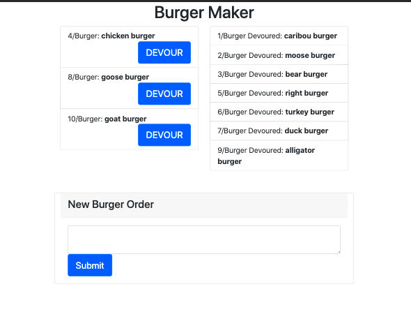

# HW11-Handlebars

**Heroku Deployment URL**
https://hw11-handlebars.herokuapp.com/

**GitHub Repository URL**
https://github.com/TalkingSkunk/HW11-Handlebars


## Table of Contents

* [Badges](#badges)
* [License](#license)
* [Description](#description)
* [Installation](#installation)
* [Features](#features)
* [Credits](#credits)
* [Contributing](#contributing)
* [Tests](#tests)
* [Contact](#contact)


## Badges

  
  
  
  
  
  


## License

MIT License

Copyright (c) 2021 Sam Kim

Permission is hereby granted, free of charge, to any person obtaining a copy
of this software and associated documentation files (the "Software"), to deal
in the Software without restriction, including without limitation the rights
to use, copy, modify, merge, publish, distribute, sublicense, and/or sell
copies of the Software, and to permit persons to whom the Software is
furnished to do so, subject to the following conditions:

The above copyright notice and this permission notice shall be included in all
copies or substantial portions of the Software.

THE SOFTWARE IS PROVIDED "AS IS", WITHOUT WARRANTY OF ANY KIND, EXPRESS OR
IMPLIED, INCLUDING BUT NOT LIMITED TO THE WARRANTIES OF MERCHANTABILITY,
FITNESS FOR A PARTICULAR PURPOSE AND NONINFRINGEMENT. IN NO EVENT SHALL THE
AUTHORS OR COPYRIGHT HOLDERS BE LIABLE FOR ANY CLAIM, DAMAGES OR OTHER
LIABILITY, WHETHER IN AN ACTION OF CONTRACT, TORT OR OTHERWISE, ARISING FROM,
OUT OF OR IN CONNECTION WITH THE SOFTWARE OR THE USE OR OTHER DEALINGS IN THE
SOFTWARE.


## Description

### What needs are we meeting?
* You are on a diet,
    * who needs to keep track of your daily caloric intake,
    * So you need a food tracker.


### What would be the foreseeable consequences if the needs are unmet?
* You will not be able to know how much calorie you have consumed in the day.


### What were your goals?
* Take input from user,
* Save the input on SQL database, and
* Allow user to keep track of what food to eat, and the food that has already been eaten in the day.


### What have you done about it?
* All goals are met.


## Installation

1. All you need is a working computer or phone!


## Features

```
GIVEN the application,
WHEN I open the Burger Maker,
THEN I am presented with a page.
WHEN I input a name of food,
THEN I can see the food to be consumed on the left side of page.
WHEN I click the ```DEVOUR``` button,
THEN the food will be recorded as ```DEVOURED``` and moved to the right side of page.
```




## Credits

@Fil
@Luca
@ASKBCS Learning Assistant Online Help

### Tutorials
* https://developer.mozilla.org/
* https://stackoverflow.com/


## Contributing

[Contributor Covenant](https://www.contributor-covenant.org/version/2/0/code_of_conduct/code_of_conduct.md)


## Tests

Console.log


## Contact

**GitHub: https://github.com/TalkingSkunk**  
**Email: sendtosamkim@gmail.com**


&copy; 2021 Sam Kim